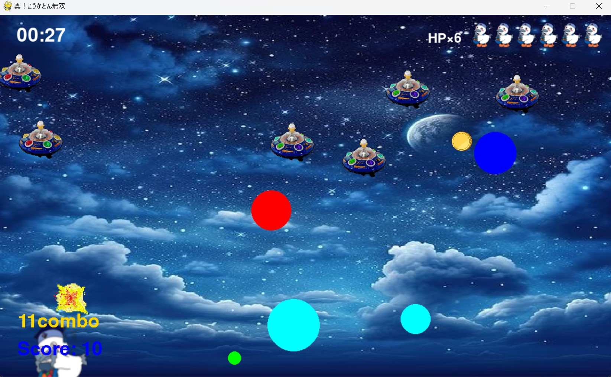

# こうかとん ⭐ お空のぽよぽよシューティング ⭐

## 実行環境の必要条件

- python >= 3.10
- pygame >= 2.1

## ゲームの概要

主人公キャラクターこうかとんをキーボードで操作するシューティングゲーム。

連続で敵を倒すとコンボボーナスを獲得！コンボを貯めて必殺技を繰り出そう！

約１分経過後に、ボスが登場。ボスに 10 回攻撃して、倒せたらゲームクリアとなる。

## ゲームの遊び方

### 操作

- 移動：`←` `↑` `↓` `→`
- 高速移動：`S`を押しながら移動入力（速度 1.5 倍）
- 攻撃（単発ビーム）： `SPACE`

#### 特殊攻撃（消費コンボ数）

- ５つのビームを同時に放つ弾幕攻撃を行う：`Z`を押しながら`SPACE`（0）
- 一定時間、重力場を出して敵を消滅させる：`ENTER`（20）
- 画面内にいる敵機を行動不能にし、爆弾を鈍化させる：`E`（20）
- 一定時間、攻撃を防ぐシールドを１つだけ装備する：`A`（10）

※ボスには弾幕攻撃以外効かない。

### ルール詳細

- 敵や敵からの攻撃を倒すごとにスコアが加算される
- 加算スコアはそれぞれ、爆弾：1 点、敵機：10 点
- 連続で倒すことで、スコアとは別に「コンボ」が加算される
- コンボを消費することで特殊攻撃を使用できる
- ステージ内にときどき現れるコインでもコンボを獲得できる（1 コイン=10 コンボ）

## ゲームの実装

### 共通基本機能

- 背景画像と主人公キャラクターの描画
- 操作に応じてビームを描画

### 担当追加機能

#### 実装した機能

- 時間表示(カウントアップ)（担当：安田）
- ステージをランダムで変える（担当：平塚）
- 残機と HP の追加（担当：稲玉）
- UFO の上下、左右運動（担当：稲玉）
- ちいさな爆発エフェクト（担当：稲玉）
- ボーナスコインの出現（担当：田中）
- コンボ制の導入（担当：菊池）
- ボスキャラの登場（担当：菊池）

#### 余裕があったら実装したかった機能

- 操作方法の表示
- ビームの変更（担当：平塚）

### ToDo

- [x] time モジュールを利用して上部に経過時間を表示
- [x] 背景画像を複数用意、ランダムに選択して描画
- [x] こうかとんの体力に関する機能追加
- [x] 新たに Coin クラスを作成；ランダムな位置にボーナスコインを描画する
- [x] 新たに Combo クラスを作成；敵を連続で倒したりコインを獲得したりするとコンボが増える
- [x] 新たに Boss クラスを作成；経過時間によって周囲の敵を消去し、ボスを描画する
- [ ] 操作方法をまとめた画像を作り、ゲーム開始時に表示
- [ ] ビームをぽよぽよしている感じに変更

### メモ

- すべてのクラスに関係する関数は，クラスの外で定義してある
- 各クラスをクラス群に分類して整理している
- Python の基本的なコード規約は厳守すること
